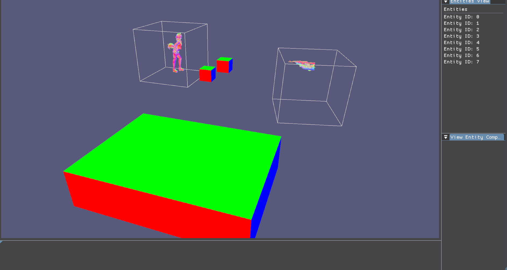
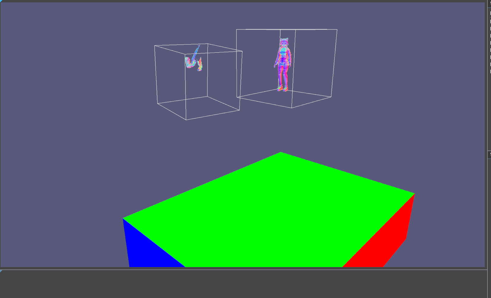

## **Project**
This project is a refactor of [previous project](https://github.com/mewingchessmogger/vulkan_renderer_cmake)  focusing on way better code architecture and more reusable abstractions, currently only rendering with one pipeline showing normals of models. 
The libraries im using are: tinygltf, glm, vma, vkbootstrap(ive done [oovervoord's tutorial](https://vulkan-tutorial.com/) before so im not gonna search for queues again!), imgui, glfw, assimp (tinygltf was pain to work with), and cr.h which makes hot reloading dlls much easier.

vulkan sdk is required, all else is packed into proj

Currently planning on making physics engine, rendering improvement and save/load scene systems.can run gpu driven skeletal animations, altough its hardcoded to 100 fps per animation

